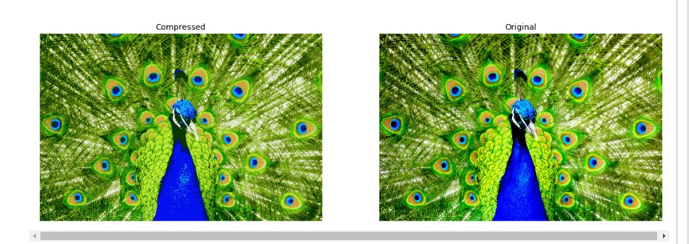

# Image-Compression-Using--KMeans
Image Compression is a technique in which the existing pixel size of a picture is reduced by adopting the most suitable least value. This least size of pixels in an image is determined by implementing the use case of K-Means clustering algorithm. K-Means is an unsupervised machine learning algorithm in which the un-labelled data points are sorted to form k clusters based on certain similarity criterion such as euclidean distance between them. The value of K is usually provided by the user and depends upon certain factors. In this project the value of K will determine the total number of colors that will be used to reproduce the image, as expected the value of K will certainly be less than the total number of colors used in the original image(which is in fact very large).  

# Compressed Vs Original Image
   
# Tools and Library Used.
1. Jupyter Notebook.
2. Numpy.
3. MatplotLib
4. Sklearn
5. os
6. ipywidgets

# Methodology
The image to be used for compression is read inside our project notebook, and the original shape of the image is observed. This is the resolution which needs to be compressed. The compressed image is saved along with the codebook. The compressed image saved is the cluster label of each pixel of the original image after performing K-Means Clustering. Codebook is the the list of cluster centers (3-d RGB) achieved after running k-means algorithm.  

The actual size of the image is transformed into one long vector for each of the color channels (RGB) using the .reshape(-1,3) and each of the color values are normalised by dividing by 255.

The next step is to perform K-Means clustering on the long vector by choosing a suitable value for 'K'.This will ensure that all the colour combinations in the original image have been quantized to 'K' distinct colours only.

Last step is to perform image decompression by assigning the 3-d colours from the code book to the each pixel depending upon its label.

# Special Note
In order to make this project user-interactive, the @interact (ipywidgets.interact) function is used for automatically creating a user interface (UI) control in the form of a slider (IntSlider) so as to set the value of 'k' parameter. This is required since re-running the code cell with updated k values is bit of tiresome and prone to errors. Hence enabling user-interactive interface.

# Conclusion
Thus, the image compression program using K-Means Clustering is successfully implemented. One thing to keep in mind while choosing the value of k is that there is a trade off between the execution time and the extent of compression achieved in an image. Higher ‘k’ will produce better quality of compressed image but will take longer to execute.
